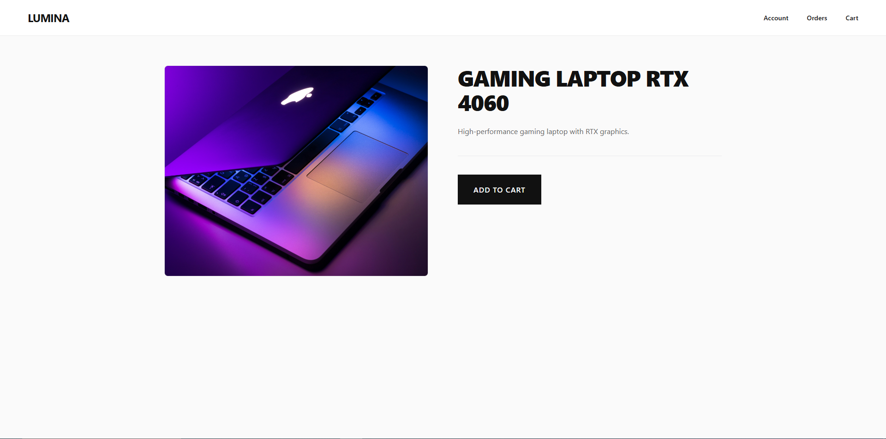
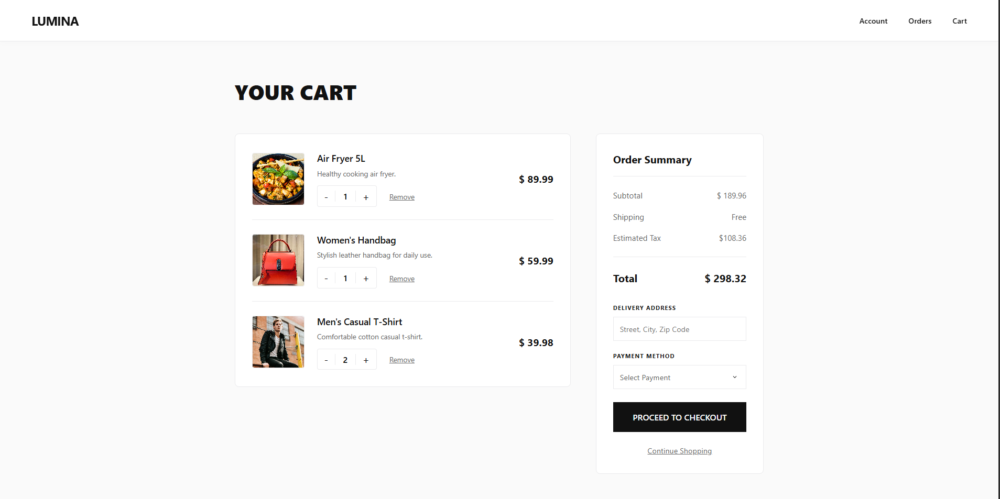
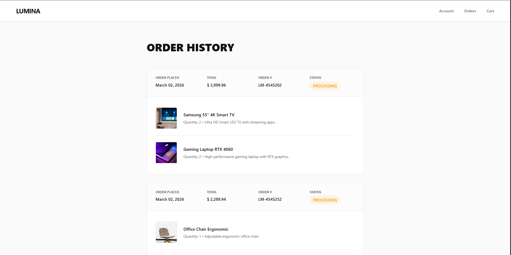
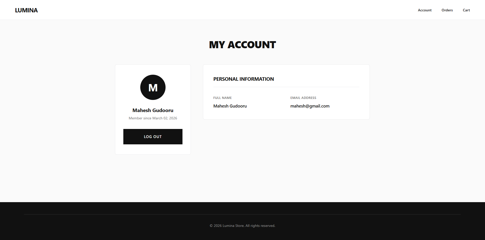

# Ecommerce Web Application

A full-featured e-commerce web application built with Java, Hibernate ORM, and JSP.

</img>
</img>
</img>
</img>
</img>
</img>

## Features

- **User Management**: User registration, login, and profile management
- **Product Catalog**: Browse and view products by category (Electronics, etc.)
- **Shopping Cart**: Add/remove items and manage quantities in cart
- **Orders**: Create orders, view order history with order items
- **Admin Panel**: Add and manage products
- **Database Persistence**: Hibernate ORM for data management

## Tech Stack

- **Backend**: Java 21
- **Web Framework**: Jakarta Servlet/JSP
- **ORM**: Hibernate
- **Build Tool**: Maven
- **View Layer**: JSP with JSTL

## Project Structure

```
src/
├── main/
│   ├── java/com/techouts/
│   │   ├── App.java (Main application entry point)
│   │   ├── dao/ (Data Access Objects)
│   │   ├── entities/ (JPA entities)
│   │   ├── filters/ (Servlet filters)
│   │   ├── servlets/ (Request handlers)
│   │   └── utils/ (Utility classes)
│   ├── resources/ (Configuration files)
│   └── webapp/
│       ├── jsp/ (JSP pages)
│       ├── static/css/ (Stylesheets)
│       └── WEB-INF/
└── test/ (Unit tests)
```

## Key Pages

- **home.jsp** - Landing page with product listings
- **login.jsp** - User login
- **register.jsp** - User registration
- **product.jsp** - Product details
- **cart.jsp** - Shopping cart management
- **order.jsp** - Order checkout
- **profile.jsp** - User profile
- **admin/addproducts.jsp** - Admin panel to add products
- **admin/allproducts.jsp** - Admin panel to view all products

## Building & Running

### Prerequisites
- JDK 21+
- Maven 3.6+
- Database (configured in `hibernate.cfg.xml`)

### Build
```bash
mvn clean install
```

The application will be available at `http://localhost:8080/Ecommerce`

## Configuration

Database configuration is located in:
- `src/main/resources/hibernate.cfg.xml`

Update the database connection settings as needed for your environment.